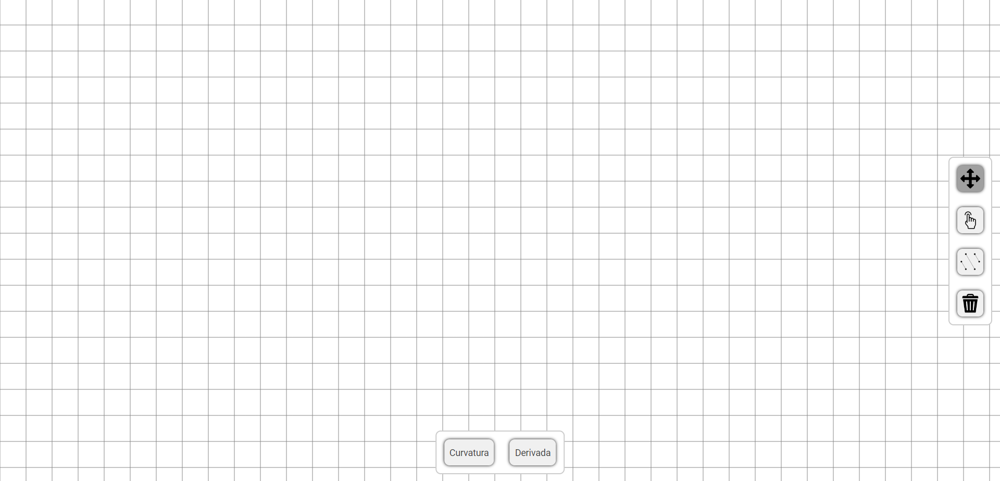
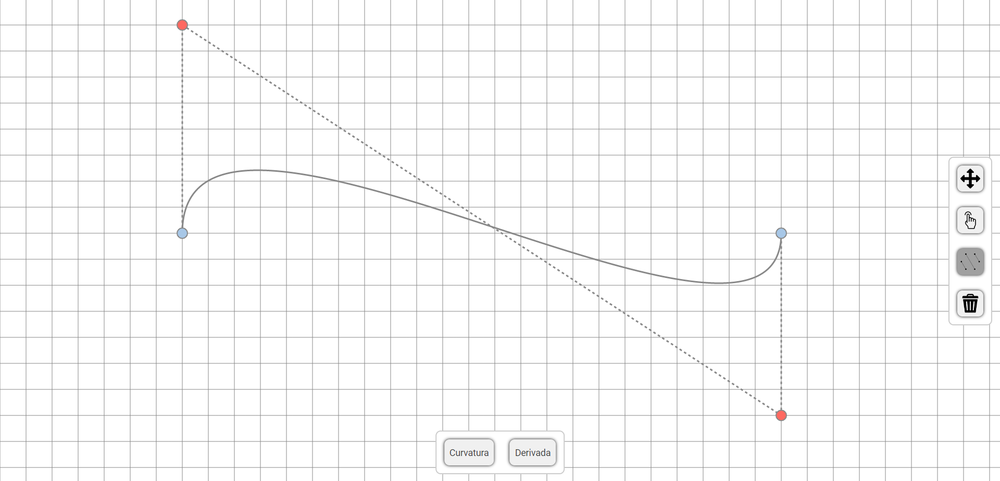
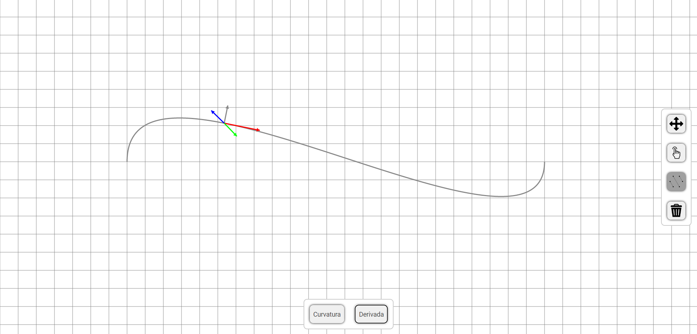
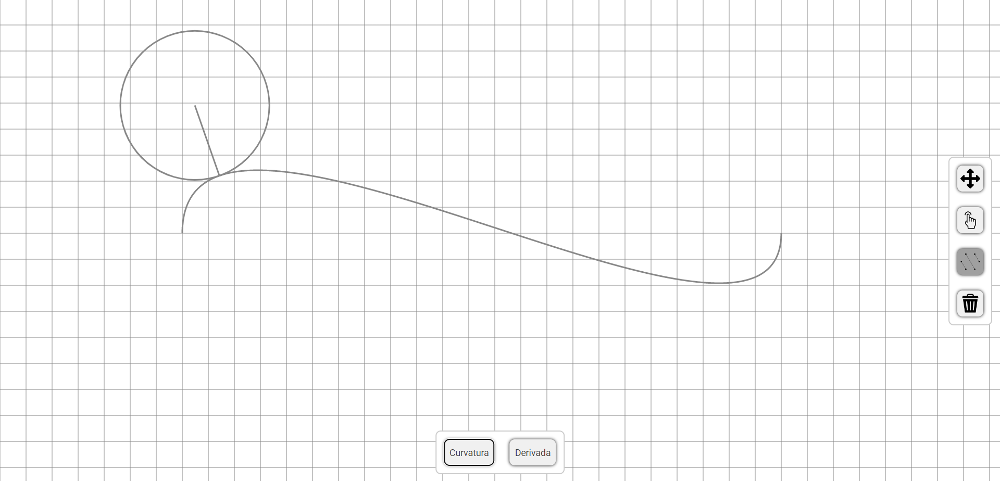

<h1 align="center">
  BEZIER CURVE
</h1>

<h2 align="center">Javascript implementation to visualize bezier curves</h2>

## 🔧 Resources
* Move in canvas.
* Create bezier curves.
* Delete created curve.
* Plot curvature animation.
* Plot derivative animation.

## ❓ How to use?

### Run

```bash
$ cd BEZIER-CURVE
$ browsername ./index.html
```

## 💻 Web View

<h1 align="center">
  
</h1>

<h1 align="center">
  
</h1>

<h1 align="center">
  
</h1>

<h1 align="center">
  
</h1>

<br>

<p align="center">
Created by Bruno Lemos and Lucas Lemos.
</p>
